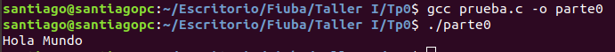

# Tp0
Trabajo practico 0 - Taller I

## Parte 0

- a) Captura de pantalla de la ejecucion del aplicativo

  ​	

  

  

- b) **Para que sirve Valgrind? Cuales son sus opciones mas comunes?**

  ​	Valgrind es una herramienta que permite depurar, o "debuggear", programas brindando informacion muy util en cuanto a problemas de memoria y rendimiento. La herramienta mas usada en valgrind es **memcheck** que es la que se ejecuta por defecto al correr un programa con valgrind.

- c) **¿Qué representa sizeof()? ¿Cuál sería el valor de salida de sizeof(char) y sizeof(int)?**

  ​	Sizeof() es una funcion la cual recibe un parametro el cual puede ser el nombre de una variable o un tipo de datos y devuelve su  tamaño en Bytes.

  ​	Teniendo en cuenta lo mencionado, el valor de salida de sizeof(char) debe ser 1 mientras que el valor de salida de sizeof(int) debe ser 4.

- d) **¿El sizeof() de una struct de C es igual a la suma del sizeof() de cada uno sus elementos? Justifique mediante un ejemplo**.

  ​	El valor de retorno de sizeof() al tener como parametro un struct no siempre es igual a la suma de los retornos de sizeof() aplicado a cada valor del struct. 

  ​	Si en el struct tengo campos que tienen distinto tipo de dato (uno mas largo que los demas) el resultado no sera igual ya que el compilador "rellena" el espacio faltante para que todos los campos sean igual de largos y asi evitar problemas de alineacion.

  

  ​	Tenemos un struct con dos campos, x e y, donde x es un int e y es un short int. La longitud en bytes del int es 4 y del short int es 2, sin embargo el sizeof() sobre el strcut indica 8bytes pero en la suma de los elemtos indica 6bytes. Debajo se adjunta imagen del "relleno" que hace el compilador y a eso se debe que el sizeof() del struct retorne 8bytes.

  

  

- e) **Investigar la existencia de los archivos estándar: STDIN, STDOUT, STDERR. Explicar brevemente su uso y cómo redirigirlos en caso de ser necesario (caracteres > y <) y como conectar la salida estándar de un proceso a la entrada estándar de otro con un pipe (carácter | ).**

  - STDIN: Entrada estandar, consiste en los datos que son enviados al programa. El descriptor asociado al stdin es el 0.
  - STDOUT: Salida estandar, es la manera por la cual el programa devuelve los datos luego de su ejecucion. El descriptor de archivo que le corresponde es el 1.
  - STDERR: Error estandar, es el canal por el cual se envia un mensaje de error en caso de que la ejecucion falle

​	La salida estandar de un programa se puede conectar con la entrada estandar de otro progama utilizando un pipe. El segundo proceso lee directamente los resultados del proceso anterior. La forma de utilizarlo es la siguiente `$ prog1 | prog2 `. Se ejecutara el prog1 y su salida estandar se conecta con la entrada estandar del prog2.

## Paso 1 

Luego de realizar la entrega del paso1 en el sercom vemos que la tarea finaliza con errores, tanto para la generacion del ejecutable como en los estilos.

- a) **Errores de estilo**

  

  Como vemos, el linter nos indica cada error de estilo encontrando y en que linea de codigo sucede. 

  Los errores 1 a 7 se encuentran en el archivo paso1_wordscounter.c:

  - **Error 1:** Hace referencia a un espacio faltante ente el while y la apertura de parentesis.
  - **Error 2 y 3:** hacen referencia a que dentro de los parentesis del if de la linea 41 hay espacios en blanco que no deberian estar.
  - **Error 4:** Indica que en una sentencia if/else el else debe ir seguido del bracket ( } ) del if y no debe ir una linea debajo.
  - **Error 5:**
  - **Error 6:** Falta un espacio entre el if y la apertura de los parentesis.
  - **Error 7:** Indica que hay un espacio de mas entre el valor que se retorna y el punto y coma.

  Los errores 8 a 10 se encuentran en el archivo paso1_main.c:

  - **Error 8:** Indica que, casi siempre, es mejor usar la funcion snprintf() en lugar de strcpy()
  - **Error 9:** Idem al error 4. El else debe ir seguido al cierre del if, sin un enter entre medio.
  - **Error 10:** Idem al error 5.

  El error 11 se encuentra en el archivo paso1_wordscounter.h:

  - **Error 11:** Indica que linea de codigo (linea 5) no deberia superar los 80 caracteres de largo ya que la misma tiene 82 caracteres.

  

- b) **Errores de generacion del ejecutable**

  

  Todos los errores son errores de compilacion ya que se esta compilando con el flag -c el cual indica que se debe precompilar y compilar pero no linkear, descripcion de los errores:

  - **Error 1:** El compilador no reconoce el tipo de dato 'wordscounter_t'
  - **Error 2,3,4,5:** Indican que se esta llamando a una funcion que no esta explicitamente declarada, el compilador no tiene informacion para asegurar que dichas funciones existen.

  

- c) **¿El sistema reportó algún WARNING? ¿Por qué?**

  ​	El sistema no reporto ningun warning ya que al compilar se utilizo el flag -Werror el cual genera que los warning (los hay en este caso) sean tradatos como errores.

  ​	

## Paso 2

- a) **Describa en breves palabras las correcciones realizadas respecto de la versión anterior.**

  Luego de ejecutar el comando diff vemos que se corrigieron todos los errores de estilo mencionados en el paso1, tambien se hizo el include de paso2_wordscounter.h que faltaba en el paso1.

- b) **Captura de pantalla indicando la correcta ejecución de verificación de normas de programación.**

  

- c) **Captura de pantalla indicando los errores de generación del ejecutable. Explicar cada uno e indicar si se trata de errores del compilador o del linker.**

  

Todos los errores se tratan de errores en la compilacion (con el flag -c nunca se linkea, luego de compilar se frena el proceso). Los errores se producen ya que falta  incluir la biblioteca estandar (se puede incluir en el paso2_wordcounter.h o en el paso2_wordcounter.c y hacer el include de paso2_wordcounter.h luego de declarar las demas bibliotcas) que es la que contiene el tipo de dato size_t (sercom recomienda stddef pero con la estandar alcanza). Luego, tampoco puede resolver el malloc ya que no esta incluida la biblioteca <stdlib> la cual lo contiene, esto genera que no se pueda compilar ya que el compilador no puede verificar que esta funcion existe (no hay una definicion explicita). 

## Paso 3

- a) **Describa en breves palabras las correcciones realizadas respecto de la versión anterior.**

  En el paso 3 se agrego el include de la biblioteca stdlib que en el paso 2 no estaba y tambien se incluyeron las bibliotecas estandar y string en el archivo paso3_wordscounter.h.

- b) **Captura de pantalla indicando los errores de generación del ejecutable. Explicar cada uno e indicar si se trata de errores del compilador o del linker.** 

En este caso el error proviene del linker. El compilador tiene todo lo necesario para generar el codigo objeto pero para armar el ejecutable el linker debe indicar la posicion de cada funcion ya que de lo contrario el ejecutable no podra invocar a una funcion que no sabe donde se ecuentra. La funcion wordscounter_destroy esta declarada pero no esta implementada en ninguna parte.

## Paso 4 

- a) **Describa en breves palabras las correcciones realizadas respecto de la versión anterior.**

  Corriendo el comando diff podemos ver que lo unico que se modifico en el paso 4 respecto al paso 3 es que se agrego la implementeacion de la funcion `void wordscounter_destroy(wordscounter_t *self);` en el archivo `paso4_wordscounter.c`.

- b) **Captura de pantalla del resultado de ejecución con Valgrind de la prueba ‘TDA’. Describir los errores reportados por Valgrind.**

  

  

  Con el resultado de ejecucion de Valgrind vemos que al final la misma quedaron abiertos 5 archivos, siendo uno de ellos el `input_tda.txt` que es el que indicamos por parametros a la hora de ejecutar (los demas corresponden al stdin, stdout, stderr, y el log de valgrind, los cuales se pueden "ignorar").

  Tambien vemos que hay perdida de memoria, no solo por el archivo que quedo abierto, si no tambien por memoria reservada por malloc (`paso4_wordscounter.c:35`) que no fue liberada (215 bloques).

- c) **Captura de pantalla del resultado de ejecución con Valgrind de la prueba ‘Long Filename’. Describir los errores reportados por Valgrind.**

  

  En el caso de un input file con un nombre largo vemos que no hay perdidas de memoria ya que el programa corta su ejecucion en la linea 13 del main debido a un buffer overflow. El buffer overflow se genera debido a que la variable filepath tiene memoria reservada para 30 caracteres y se intentan guardar mas de 30 cuando se quiere copiar el contenido de argv[1] en dicha variable en el memcpy.

- d) **¿Podría solucionarse este error utilizando la función strncpy? ¿Qué hubiera ocurrido con la ejecución de la prueba?**

- e) **Explicar de qué se trata un segmentation fault y un buffer overflow.**

  Un `segmentation fault` ocurre cuando el programa intenta acceder a memoria que no le pertenece, a memoria alocada en un area restringida para el programa. Cuando esto ocurre el programa corta su ejecucion.

  Un `buffer overflow` se da cuando un programa no controla correctamente la cantidad de datos que copia en un area reservada de memora (buffer), el buffer tiene pre-reservada cierta cantidad de bytes y cuando se excede esta cantidad el programa comenzara a escribir en las posiciones adyacentes al bloque reservado, pisando el contenido que estaba almacenado previamente en dichas posiciones.

## Paso 5

- a) **Describa en breves palabras las correcciones realizadas respecto de la versión anterior.**

  ​	En el archivo `paso5_main.c` se reemplaza la funcion `memcpy` por la funcion `strncpy` y tambien se agrega un if para verificar si cerrar el archivo. En `paso5_wordcounter.c` cambia la forma en la que se declaran los caracteres que delimitan las palabras. 

- b) **Describa el motivo por el que fallan las prueba ‘Invalid File’ y ‘Single Word’. ¿Qué información entrega SERCOM para identificar el error? Realice una captura de pantalla.**

  La informacion que brinda SERCOM para indentificar que hay errores es que el retorno del programa no coincide con la salida esperada que deberia tener.

  

  En el caso de `single_word` el error se da ya que el archivo tiene una sola palabra y no finaliza con ninguno de los caracteres especiales que delimitan el fin de la misma, eso genera que nunca se le sume uno a la cantidad de palabras leidas y retorna 0.

  En el caso de `invalid_file`

- c) **Captura de pantalla de la ejecución del comando hexdump. ¿Cuál es el último carácter del archivo input_single_word.txt?**

  

  Como se puede apreciar en la imagen el ultimo caracter del archivo `input_single_word.txt` es una letra `d`y no un caracter especial.

- d)  **Captura de pantalla con el resultado de la ejecución con gdb. Explique brevemente los comandos utilizados en gdb. ¿Por qué motivo el debugger no se detuvo en el breakpoint de la línea 45: self->words++;?**

  

  

  

El gdb no se detuvo en la linea 45 por lo explicado en b) y c), como la palabra no finaliza con alguno de los caracteres especiales el `if(strchr(delim_words, c) != NULL)` siempre da false y provoca que el programa nunca entre a la linea 45. Como resultado de ello, nunca se incrementa el contador de palabras y el retorno del programa es cero.

- **Comandos:**  
  - Info Functions: Si no recibe parametros lista todas las funciones de todos los modulos cargados.
  - List <parametro>: El parametro puede ser una linea o una funcion y se imprimira en pantalla 10 lineas de codigo centradas en la linea del parametro. Si se usa sin parametro luego de haber aplicado un list previamente, imprimira 10 lineas mas desde la ultima del list anterior. 
  - Break: Sirve para ubicar break points, estos son puntos de corte para que el programa frene su ejecucion al llegar a uno de ellos. Si ubico un breakpoint y el programa nunca para puedo asegurar que el programa no pasa por esa linea.
  - Run: Corre el programa.

## Paso 6

- a) **Describa en breves palabras las correcciones realizadas respecto de la versión anterior.**

  Ejecutando el comando diff vemos que en el `paso6_main.c` cambia la definicion de error de -1 a 1. En el archivo `paso6_wordscounter.c` los caracteres que delimitan las palabras ahora estan en un define, y se modifica la funcion `wordscounter_next_state` para evitar los problemas del paso5.

- b) **Captura de pantalla mostrando todas las entregas realizadas, tanto exitosas como fallidas.**

- c) **Captura de pantalla mostrando la ejecución de la prueba ‘Single Word’ de forma local con las distintas variantes indicadas.**

  
